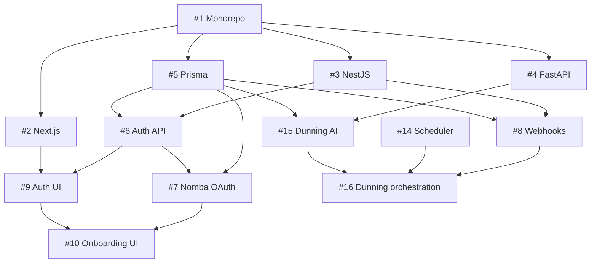

# NombaFlow — GitHub Issues & Project Board Setup

**Purpose:** This document contains every GitHub issue your team needs to create, organized into milestones and labeled correctly. Each issue is self-contained: anyone who picks it up can read it and know exactly what to build, what the acceptance criteria are, and which documents to reference.

**Team:** Backend Developer, Full Stack Developer, AI Specialist — see [Team Assignments](./TEAM_ASSIGNMENTS.md)

**How to use this:**
1. Read **Section 0** (standards, Definition of Done, dependency map) — mandatory for all contributors
2. Create a GitHub repository named `nombaflow`
3. Create the labels listed in Section 1
4. Create the milestones listed in Section 2
5. Create each issue exactly as written in Sections 3 through 8 (use the Issue Index table for sizing and dependencies)
6. Add issues to the GitHub Project board in the order listed in Section 7

---

## 0. Issue Standards (apply to every ticket)

### 0.1 Global Definition of Done

An issue moves to **Done** only when ALL of the following are true:

| # | Criterion |
|---|---|
| 1 | Every task checkbox in the issue is complete |
| 2 | Every acceptance criterion is verified locally or on staging — not just "looks right" |
| 3 | PR merged to `develop` with at least one teammate review |
| 4 | No secrets, debug logs, or placeholder text in production paths |
| 5 | Matches [API Contract](../engineering/NombaFlow_API_Contract_v2.md) / [UI Spec](../product/NombaFlow_UI_Spec.md) as applicable |
| 6 | [Coding Standards](../engineering/CODING_STANDARDS.md) §6 security checklist passed |
| 7 | Issue assignee confirmed behavior on their machine (or staging URL for deploy issues) |

### 0.2 Issue sizing

| Size | Hours | When to use |
|---|---|---|
| **S** | 1–3h | Config, single screen, single endpoint |
| **M** | 3–6h | Module with 2–3 endpoints, or multi-component screen |
| **L** | 6–10h | Nomba integration, billing scheduler, ajo module |

**Rule:** If an issue exceeds 10 hours, split it. None of the 32 issues below should exceed **L**.

### 0.3 Standard issue fields (when creating in GitHub)

Copy this template into each GitHub issue body above the tasks:

```markdown
## Objective
[One sentence: what capability exists when this is done]

## Size
S | M | L

## Depends on
#X, #Y (or "None")

## Blocks
#Z (issues that cannot start until this is Done)

## Definition of Done
- [ ] All acceptance criteria verified
- [ ] PR reviewed and merged to develop
- [ ] Security checklist (Coding Standards §6) passed
```

### 0.4 Issue index

| # | Title | Owner | Size | Depends | Blocks |
|---|---|---|---|---|---|
| 1 | Monorepo init | fullstack | M | — | 2,3,4,5,11 |
| 2 | Next.js scaffold | fullstack | M | 1 | 9,19–24 |
| 3 | NestJS scaffold | backend | M | 1 | 5,6,8 |
| 4 | FastAPI scaffold | ai | S | 1 | 15,26–28 |
| 5 | Prisma schema | backend | M | 1 | 6,7,8,12–18 |
| 6 | Auth API (JWT) | backend | M | 3,5 | 9,12 |
| 7 | Nomba OAuth | backend | L | 5,6 | 10,13,14,17 |
| 8 | Webhook receiver | backend | L | 3,5 | 14,16,18 |
| 9 | Login/register UI | fullstack | M | 2,6 | 10,19 |
| 10 | Onboarding UI | fullstack | S | 2,7,9 | 19 |
| 11 | CI pipeline | backend | S | 1 | — |
| 12 | Plan CRUD | backend | M | 5,6 | 13,19,20 |
| 13 | Enrollment + Checkout | backend | L | 5,7,12 | 14,21,24 |
| 14 | Billing scheduler | backend | L | 5,7,13 | 16,18 |
| 15 | Dunning model | ai | M | 4,5 | 16 |
| 16 | Dunning orchestration | backend | L | 8,14,15 | 18,22 |
| 17 | Ajo module | backend | L | 5,7,13,14 | 23 |
| 18 | Email notifications | backend | M | 3,5,14,16 | — |
| 19 | Dashboard UI | fullstack | M | 2,9,12 | 22 |
| 20 | Plans UI | fullstack | M | 2,9,12 | — |
| 21 | Enrollment UI | fullstack | M | 2,13 | — |
| 22 | Subscription detail + dunning badge | fullstack | M | 2,16,19 | — |
| 23 | Ajo UI | fullstack | M | 2,17 | — |
| 24 | Customer portal UI | fullstack | M | 2,13 | — |
| 25 | Analytics API | backend | M | 5,12,14 | 19,26 |
| 26 | Forecast model | ai | M | 4,15 | 28 |
| 27 | Churn model | ai | S | 15,16 | — |
| 28 | NL insights | ai | M | 26 | — |
| 29 | Production deploy | backend | M | Day 2 | 30,32 |
| 30 | Demo seed data | backend | M | 29 | 32 |
| 31 | UI polish | fullstack | M | 19–24 | 32 |
| 32 | Submission + demo | fullstack | M | 29,30,31 | — |

### 0.5 Dependency graph (Day 1 critical path)



---

## 1. Labels to Create First

Create these labels in GitHub before creating any issues.
Settings → Labels → New Label

| Label Name | Color | Meaning |
|---|---|---|
| `type: setup` | `#0075ca` | Repo, infra, tooling setup |
| `type: backend` | `#e4e669` | NestJS API work |
| `type: frontend` | `#d93f0b` | Next.js UI work |
| `type: ai` | `#0e8a16` | Python AI service work |
| `type: database` | `#5319e7` | Schema, migrations, queries |
| `type: nomba` | `#f9d0c4` | Nomba API integration |
| `type: devops` | `#bfd4f2` | CI/CD, deployment, environment |
| `priority: critical` | `#b60205` | Blocks other work, Day 1 must |
| `priority: high` | `#e99695` | Must have for demo |
| `priority: medium` | `#f9d0c4` | Should have |
| `priority: low` | `#fef2c0` | Nice to have |
| `milestone: day-1` | `#c5def5` | Day 1 sprint |
| `milestone: day-2` | `#bfd4f2` | Day 2 sprint |
| `milestone: day-3` | `#d4c5f9` | Day 3 sprint |
| `owner: backend` | `#ededed` | Backend Developer |
| `owner: fullstack` | `#ededed` | Full Stack Developer |
| `owner: ai` | `#ededed` | AI Specialist |

---

## 2. Milestones to Create

Settings → Milestones → New Milestone

| Milestone | Description | Due Date |
|---|---|---|
| `Day 1 — Foundation` | Repo, infra, auth, database, first Nomba integration | Day 1 end |
| `Day 2 — Core Engine` | Billing engine, webhooks, dunning, ajo, dashboard | Day 2 end |
| `Day 3 — Polish & Demo` | UI polish, deployment, demo prep, submission | Hackathon deadline |

---

## 3. MILESTONE: Day 1 — Foundation

---

### ISSUE #1

**Title:** `[SETUP] Initialize monorepo structure and GitHub repository`

**Labels:** `type: setup`, `priority: critical`, `milestone: day-1`, `owner: fullstack`

**Objective:** Project monorepo and GitHub repository exist; teammates can clone and begin Day 1 issues.

**Size:** M  
**Depends on:** None  
**Blocks:** #2, #3, #4, #5, #11

**Description:**
Set up the project foundation before anyone writes feature code. Every other issue depends on this one being complete first.

**Tasks:**
- [x] Create GitHub repo `nombaflow`, set to public
- [x] Initialize monorepo with the following structure:
```
nombaflow/
├── apps/
│   ├── web/          (Next.js 16)
│   ├── api/          (NestJS 11)
│   └── ai-service/   (Python FastAPI)
└── packages/
    ├── database/     (Prisma schema)
    └── types/        (shared TypeScript types)
```
- [x] Set up `main` and `develop` branches, protect `main` (require PR to merge)
- [x] Add `.gitignore` covering `node_modules`, `.env`, `.env.local`, `__pycache__`, `*.pyc`, `dist`, `.next`
- [x] Add root `README.md` with project name, description, and links to each app
- [ ] Add root `package.json` with `"packageManager": "pnpm@9.x"` and workspace scripts — **done in repo**
- [ ] Add `pnpm-workspace.yaml` defining `apps/*` and `packages/*` — **done in repo**
- [ ] Name workspace packages: `@nombaflow/web`, `@nombaflow/api`, `@nombaflow/database`, `@nombaflow/types` — **done in repo**
- [ ] Scaffold `apps/web`, `apps/api`, `apps/ai-service`, `packages/database`, `packages/types` — **done (minimal); Issues #2–#4 add full tooling**
- [x] Run `pnpm install` from root to verify workspace resolves; commit `pnpm-lock.yaml`

**Definition of Done:** Section 0.1 + all acceptance criteria below verified on GitHub.

**Acceptance criteria:**
- Repo exists and is accessible to all team members
- Branch protection is active on `main`
- `.env` files are confirmed absent from the repo
- All three team members have cloned the repo and can see the folder structure

**References:** Environment Variables doc (Section 7 — secrets checklist)

---

### ISSUE #2

**Title:** `[SETUP] Scaffold Next.js 16 frontend application`

**Labels:** `type: setup`, `type: frontend`, `priority: critical`, `milestone: day-1`, `owner: fullstack`

**Depends on:** #1

**Description:**
Initialize the Next.js 16 frontend with all base tooling configured. This should be the only setup the Full Stack Developer needs before building screens.

**Tasks:**
- [ ] Scaffold Next.js 16 with App Router inside `apps/web`
- [ ] Install and configure TypeScript 5.x
- [ ] Install and configure TailwindCSS v4 (CSS-first config, no `tailwind.config.js`)
- [ ] Install and configure shadcn/ui (latest, Tailwind v4 compatible)
- [ ] Install Recharts for dashboard charts
- [ ] Install React Hook Form and Zod for form validation
- [ ] Set up global CSS file with design tokens from UI Spec Section 1 (colors, typography, status badge colors)
- [ ] Create `apps/web/.env.local` from the Environment Variables doc template (Section 2)
- [ ] Connect Vercel — link the `apps/web` directory, auto-deploy on push to `develop`
- [ ] Confirm the default Next.js page loads at `localhost:3000`

**Acceptance criteria:**
- `pnpm --filter @nombaflow/web dev` starts without errors
- Design tokens are visible in browser DevTools under `:root`
- Vercel preview URL is shared in team chat

**References:** UI Spec (Section 1 — Design System Tokens), Environment Variables doc (Section 2)

---

### ISSUE #3

**Title:** `[SETUP] Scaffold NestJS 11 backend application`

**Labels:** `type: setup`, `type: backend`, `priority: critical`, `milestone: day-1`, `owner: backend`

**Depends on:** #1

**Description:**
Initialize the NestJS backend with all base modules and middleware configured.

**Tasks:**
- [ ] Scaffold NestJS 11 inside `apps/api` using the NestJS CLI
- [ ] Install and configure TypeScript
- [ ] Install Zod for request validation
- [ ] Install Helmet for HTTP security headers
- [ ] Install and configure Pino for structured JSON logging
- [ ] Set up global exception filter that returns the error shape from API Contract Section 13
- [ ] Set up global validation pipe using Zod
- [ ] Configure CORS to allow only the frontend URL
- [ ] Create `apps/api/.env` from the Environment Variables doc template (Section 3)
- [ ] Connect Railway — link the `apps/api` directory, confirm health-check endpoint at `GET /health` returns `{ status: "ok" }`

**Acceptance criteria:**
- `pnpm --filter @nombaflow/api start:dev` starts without errors
- `GET /health` returns `200 { status: "ok" }`
- Any request with an invalid body returns the standard error shape from API Contract Section 13
- Railway deployment URL is shared in team chat

**References:** API Contract v2 (Section 13 — Error Response Standard), Environment Variables doc (Section 3)

---

### ISSUE #4

**Title:** `[SETUP] Scaffold Python FastAPI AI service`

**Labels:** `type: setup`, `type: ai`, `priority: critical`, `milestone: day-1`, `owner: ai`

**Depends on:** #1

**Description:**
Initialize the Python AI service with dependencies installed and a health-check endpoint deployed.

**Tasks:**
- [ ] Initialize Python 3.13 project inside `apps/ai-service`
- [ ] Create `requirements.txt` with: `fastapi`, `uvicorn`, `scikit-learn`, `lightgbm`, `pandas`, `numpy`, `anthropic`, `psycopg2-binary`, `python-dotenv`, `pydantic`
- [ ] Create main FastAPI app with `GET /health` endpoint returning `{ "status": "ok" }`
- [ ] Add internal auth middleware: reject any request missing the correct `X-Internal-Secret` header (value from env var)
- [ ] Create `apps/ai-service/.env` from the Environment Variables doc template (Section 4)
- [ ] Deploy to Railway, confirm health-check is accessible
- [ ] Share Railway AI service URL with Backend Developer for `AI_SERVICE_URL` env var

**Acceptance criteria:**
- `uvicorn main:app --reload` starts without errors
- `GET /health` returns `200 { "status": "ok" }`
- Any request without the correct `X-Internal-Secret` header returns `401`
- Railway deployment URL is shared with team

**References:** Environment Variables doc (Section 4), API Contract v2 (Section 12 — Backend to AI Service Contract)

---

### ISSUE #5

**Title:** `[DATABASE] Write Prisma schema and run first migration`

**Labels:** `type: database`, `priority: critical`, `milestone: day-1`, `owner: backend`

**Depends on:** #1

**Description:**
The Prisma schema is the single source of truth for the data model. This must be complete and migrated before any backend feature work begins.

**Tasks:**
- [ ] Create `packages/database/prisma/schema.prisma` using the Database Schema doc as the exact source
- [ ] Add the Prisma 7 generator block: `provider = "prisma-client"`, `output = "../generated/prisma"`
- [ ] Add all enums from Database Schema doc Section 2
- [ ] Add all models from Database Schema doc Sections 3, 4, and 5
- [ ] Use `nombaTokenKey` (not `nombaTokenId`) on Customer model per Nomba Verified doc Correction 5
- [ ] Use Nomba OAuth credential fields on Merchant model per Nomba Verified doc Section 6
- [ ] Add all indexes including the three critical ones in Database Schema doc Section 6
- [ ] Provision Neon PostgreSQL, copy connection string to `.env`
- [ ] Run `pnpm exec prisma migrate dev --name init` (from `packages/database`)
- [ ] Run `pnpm exec prisma generate`
- [ ] Confirm `pnpm exec prisma studio` opens and shows all tables

**Acceptance criteria:**
- All tables exist in Neon with correct columns and types
- `pnpm exec prisma studio` shows every table from the schema
- No migration errors in the output
- Schema file is committed and pushed

**References:** Database Schema doc (all sections), Nomba API Verified doc (Sections 5 and 6)

---

### ISSUE #6

**Title:** `[BACKEND] Implement merchant authentication (register, login, refresh token)`

**Labels:** `type: backend`, `priority: critical`, `milestone: day-1`, `owner: backend`

**Depends on:** #3, #5  
**Blocks:** #9, #12  
**Size:** M

**Objective:** Merchants can register, log in, and refresh JWT sessions via NestJS API endpoints.

**Description:**
Build merchant authentication on the **NestJS API only** (see [Architecture ADR-002](../engineering/ARCHITECTURE.md)). Next.js auth UI is Issue #9.

**Tasks:**
- [ ] Install `@nestjs/jwt`, `@nestjs/passport`, `passport-jwt`, `bcrypt`
- [ ] Implement `POST /auth/register` per API Contract v2 Section 2
- [ ] Implement `POST /auth/login` per API Contract v2 Section 2
- [ ] Implement `POST /auth/refresh` per API Contract v2 Section 2
- [ ] Hash passwords with bcrypt (cost factor 12) before storing
- [ ] Return JWT access token (15 min expiry) and refresh token (7 day expiry)
- [ ] Create `JwtAuthGuard` and `@MerchantId()` decorator for protected routes
- [ ] Mount all merchant routes under `/api/v1` prefix

**Acceptance criteria:**
- `POST /auth/register` creates a merchant record and returns tokens
- `POST /auth/login` with correct credentials returns tokens
- `POST /auth/login` with wrong credentials returns `401` with the standard error shape
- `POST /auth/refresh` with a valid refresh token returns a new access token
- A protected route returns `401` when called without a token
- All responses match the exact shapes in API Contract v2 Section 2

**Definition of Done:** Section 0.1 + manual test via curl/Postman for all three auth endpoints.

**References:** [Architecture ADR-002](../engineering/ARCHITECTURE.md), API Contract v2 (Section 2)

---

### ISSUE #7

**Title:** `[BACKEND] Implement Nomba OAuth credential connection and token management`

**Labels:** `type: backend`, `type: nomba`, `priority: critical`, `milestone: day-1`, `owner: backend`

**Depends on:** #5, #6

**Description:**
When a merchant connects their Nomba account, NombaFlow obtains an OAuth access token and keeps it refreshed automatically. This is the most technically important integration task in the entire project.

**Tasks:**
- [ ] Build typed Nomba API client class wrapping all required endpoints
- [ ] Implement `POST /merchants/me/nomba-credentials` accepting `{ clientId, clientSecret, accountId }`
- [ ] On receive: call `POST https://api.nomba.com/v1/auth/token/issue` with client credentials
- [ ] Check `response.code === "00"` before treating as success (never rely on HTTP 200 alone)
- [ ] Encrypt and store `clientSecret`, `accessToken`, and `refreshToken` using `ENCRYPTION_KEY` (AES-256-GCM)
- [ ] Store `nombaTokenExpiresAt` on the Merchant record
- [ ] Build a BullMQ scheduled job that runs every 25 minutes, finds merchants whose token expires within 5 minutes, and calls `POST https://api.nomba.com/v1/auth/token/refresh`
- [ ] Implement `GET /merchants/me` returning `nombaConnected: true/false`
- [ ] All subsequent Nomba API calls use: `Authorization: Bearer {accessToken}`, `accountId: {merchantNombaAccountId}`

**Acceptance criteria:**
- A merchant can submit their Nomba credentials and receive `{ connected: true }`
- Invalid credentials return `422` with `INVALID_NOMBA_CREDENTIALS` error code
- The token refresh job runs without errors in logs
- Stored values in the database are encrypted (not plaintext)

**References:** Nomba API Verified doc (Correction 1 — OAuth flow, full code samples), Environment Variables doc (Section 3)

---

### ISSUE #8

**Title:** `[BACKEND] Build Nomba webhook receiver with correct signature verification`

**Labels:** `type: backend`, `type: nomba`, `priority: critical`, `milestone: day-1`, `owner: backend`

**Depends on:** #3, #5

**Description:**
The webhook receiver is how Nomba tells NombaFlow that a payment succeeded or failed. The signature verification must be exactly correct — wrong implementation means the system ignores all real payment events.

**Tasks:**
- [ ] Create `POST /webhooks/nomba` endpoint
- [ ] Return `200 OK` immediately before any processing (prevents Nomba retries)
- [ ] Implement the exact webhook signature verification from Nomba Verified doc Correction 3 (concatenated field string, HMAC-SHA256, Base64 encoded, header is `nomba-signature`)
- [ ] Read `nomba-timestamp` header for inclusion in signature check
- [ ] Deduplicate using `payload.requestId` — check WebhookEvent table before processing
- [ ] Queue accepted events to BullMQ `webhook-processing` queue
- [ ] Store raw event in WebhookEvent table with `processed: false`
- [ ] Build queue worker that routes on `event_type` using underscore names: `payment_success`, `payment_failed`, `payout_success`, `payout_failed`
- [ ] Register the webhook URL in Nomba sandbox dashboard

**Acceptance criteria:**
- A test webhook sent from Nomba sandbox is received, signature-verified, and queued
- A duplicate webhook (same `requestId`) is rejected silently without double-processing
- A webhook with an invalid signature returns nothing but logs a warning
- The `webhook-processing` queue shows jobs being picked up in BullMQ dashboard

**References:** Nomba API Verified doc (Correction 3 — exact verification function, Correction 4 — event names, Correction 7 — retry behavior)

---

### ISSUE #9

**Title:** `[FRONTEND] Build authentication screens (register and login)`

**Labels:** `type: frontend`, `priority: critical`, `milestone: day-1`, `owner: fullstack`

**Depends on:** #2, #6  
**Blocks:** #10, #19  
**Size:** M

**Objective:** Merchants can register and log in via UI; authenticated sessions persist in httpOnly cookies and protect dashboard routes.

**Description:**
Build the register and login screens. These are the entry point for every merchant.

**Tasks:**
- [ ] Build `/register` and `/login` screens per UI Spec M01, M02
- [ ] Connect forms to NestJS `POST /auth/register` and `POST /auth/login` (Issue #6)
- [ ] Store access + refresh tokens in **httpOnly cookies** (set via API route or server action — never localStorage)
- [ ] Create Next.js middleware to protect `/dashboard/*` routes — redirect unauthenticated users to `/login`
- [ ] Show inline field errors per UI Spec; toast for server errors
- [ ] Redirect to `/onboarding` after registration, `/dashboard` after login

**Acceptance criteria:**
- Registering with valid details creates an account and redirects to onboarding
- Registering with a duplicate email shows the inline error message from UI Spec M01
- Logging in with wrong credentials shows the banner from UI Spec M02
- Navigating to `/dashboard` without a session redirects to `/login`
- Forms show a spinner while the request is in flight

**Definition of Done:** Section 0.1 + manual walkthrough of register → onboarding redirect and login → dashboard.

**References:** [Architecture ADR-002](../engineering/ARCHITECTURE.md), UI Spec (Screens M01 and M02), API Contract v2 (Section 2)

---

### ISSUE #10

**Title:** `[FRONTEND] Build onboarding screen (connect Nomba credentials)`

**Labels:** `type: frontend`, `priority: critical`, `milestone: day-1`, `owner: fullstack`

**Depends on:** #2, #7, #9

**Description:**
The first screen a merchant sees after registering. They enter their Nomba client credentials here.

**Tasks:**
- [ ] Build `/onboarding` screen per UI Spec Screen M03
- [ ] Form collects three fields: Client ID, Client Secret, Account ID (not a single API key)
- [ ] Connect to `POST /merchants/me/nomba-credentials`
- [ ] On success: redirect to `/dashboard` with success toast
- [ ] On invalid credentials: show inline error under the form
- [ ] Add "Skip for now" link that redirects to `/dashboard` with a yellow persistent banner
- [ ] If merchant already has `nombaConnected: true`, redirect to `/dashboard` (do not show onboarding again)

**Acceptance criteria:**
- A new merchant who registers lands here before the dashboard
- Submitting valid Nomba credentials redirects to dashboard with success toast
- Submitting invalid credentials shows the inline error message
- Skipping lands on dashboard with the yellow banner visible

**References:** UI Spec (Screen M03), API Contract v2 (Section 3), Nomba API Verified doc (Correction 1)

---

### ISSUE #11

**Title:** `[DEVOPS] Set up GitHub Actions CI pipeline`

**Labels:** `type: devops`, `priority: high`, `milestone: day-1`, `owner: backend`

**Depends on:** #1

**Description:**
A basic CI pipeline so broken code does not reach the `develop` branch undetected.

**Tasks:**
- [ ] Create `.github/workflows/ci.yml`
- [ ] On every push to `main` and `develop` and every PR: run lint, type-check, and build for both `apps/web` and `apps/api`
- [ ] Use `pnpm/action-setup` in workflow; run `pnpm install --frozen-lockfile`
- [ ] Run `pnpm audit --audit-level=high` and fail the build if high severity vulnerabilities are found
- [ ] Add Railway deploy step on push to `develop` for both `api` and `ai-service`
- [ ] Add Vercel deploy step on push to `develop` for `web`

**Acceptance criteria:**
- Pushing to `develop` triggers the pipeline and shows pass/fail in GitHub
- A deliberate TypeScript error in a PR causes the check to fail
- A successful push to `develop` auto-deploys to staging URLs

**References:** Masterplan (Part 10 — DevOps, CI/CD pipeline YAML)

---

## 4. MILESTONE: Day 2 — Core Engine

---

### ISSUE #12

**Title:** `[BACKEND] Implement plan CRUD endpoints`

**Labels:** `type: backend`, `priority: critical`, `milestone: day-2`, `owner: backend`

**Depends on:** #5, #6

**Description:**
Merchants need to create and manage billing plans before any customers can enroll.

**Tasks:**
- [ ] `POST /plans` — create plan, per API Contract v2 Section 4
- [ ] `GET /plans` — list all plans for authenticated merchant
- [ ] `GET /plans/:id` — get plan detail including subscriber summary counts
- [ ] `PATCH /plans/:id` — update plan name and description only (not amount or interval once active)
- [ ] `DELETE /plans/:id` — archive plan (set status to ARCHIVED, do not hard delete)
- [ ] Validate all enum values (interval, planType)
- [ ] Scope every query to the authenticated `merchantId`

**Acceptance criteria:**
- All five endpoints return exactly the shapes in API Contract v2 Section 4
- Accessing another merchant's plan returns `403 FORBIDDEN`
- Archiving a plan with active subscribers returns `422` with a clear message
- Creating a plan with a negative amount returns `400 VALIDATION_ERROR`

**References:** API Contract v2 (Section 4), Database Schema doc (Plan model)

---

### ISSUE #13

**Title:** `[BACKEND] Implement customer enrollment and Nomba Checkout integration`

**Labels:** `type: backend`, `type: nomba`, `priority: critical`, `milestone: day-2`, `owner: backend`

**Depends on:** #5, #7, #12

**Description:**
When a customer clicks an enrollment link and submits their details, NombaFlow creates a Nomba Checkout order with `tokenizeCard: true` and redirects them. This is how cards get tokenised for future automatic charges.

**Tasks:**
- [ ] `POST /customers/enroll` per API Contract v2 Section 5
- [ ] Create Customer record with `PENDING` status
- [ ] Call Nomba `POST /v1/checkout/order` with `tokenizeCard: true`
- [ ] Set `callbackUrl` to `{FRONTEND_URL}/enroll/{planId}/success?orderReference={ref}`
- [ ] Check `response.code === "00"` before proceeding
- [ ] Return `{ checkoutLink, orderReference }` to frontend (field is `checkoutLink` not `checkoutUrl`)
- [ ] Store `orderReference` on Customer record for webhook matching
- [ ] Handle the `payment_success` webhook: find customer by `orderReference`, extract `tokenizedCardData.tokenKey`, update Customer `nombaTokenKey`, create Subscription record with status `ACTIVE`
- [ ] `GET /customers/:id/portal` — return customer portal data per API Contract v2 Section 5

**Acceptance criteria:**
- Submitting enrollment details returns a valid `checkoutLink` that opens Nomba Checkout
- After Nomba Checkout completes, the `payment_success` webhook correctly creates the Subscription
- `GET /customers/:id/portal` returns the correct subscription and charge history
- Enrolling the same email twice in the same plan returns `409 DUPLICATE_CUSTOMER`

**References:** API Contract v2 (Section 5), Nomba API Verified doc (Corrections 4, 5, 8), Database Schema doc (Customer, Subscription models)

---

### ISSUE #14

**Title:** `[BACKEND] Build billing scheduler and automatic charge execution`

**Labels:** `type: backend`, `type: nomba`, `priority: critical`, `milestone: day-2`, `owner: backend`

**Depends on:** #5, #7, #13

**Description:**
The heart of the billing engine. A scheduled job that finds all subscriptions due for billing and charges them via Nomba.

**Tasks:**
- [ ] Create a BullMQ repeating job that runs every hour
- [ ] Query: `SELECT subscriptions WHERE nextBillingDate <= NOW() AND status IN ('ACTIVE', 'PAST_DUE')`
- [ ] For each due subscription:
  - Create `Charge` record with status `INITIATED`
  - Generate `orderReference` in format `nf_charge_{subscriptionId}_{cycleNumber}`
  - Call Nomba `POST /v1/checkout/tokenized-card-payment` with merchant's `accessToken` and `accountId`
  - Include `X-Idempotent-key` header set to `chargeId` to prevent duplicate charges
  - Check `response.code === "00"` — if not, mark charge as `FAILED` immediately
  - If `"00"`, mark charge as `INITIATED` and wait for webhook
- [ ] Handle `payment_success` webhook: mark Charge `SUCCESS`, advance `nextBillingDate`, increment `cyclesCompleted`
- [ ] Handle `payment_failed` webhook: mark Charge `FAILED`, set Subscription to `PAST_DUE`, emit `dunning:required` event

**Acceptance criteria:**
- A subscription with `nextBillingDate` in the past gets charged on the next scheduler run
- A successful Nomba response advances the next billing date correctly
- A failed Nomba response sets the subscription to `PAST_DUE`
- The `X-Idempotent-key` prevents the same subscription being charged twice if the scheduler runs twice

**References:** Nomba API Verified doc (Section 5 — correct recurring charge code), API Contract v2 (Section 11 — webhooks), Database Schema doc (Charge model, critical index)

---

### ISSUE #15

**Title:** `[AI] Build smart dunning prediction model and API endpoint`

**Labels:** `type: ai`, `priority: critical`, `milestone: day-2`, `owner: ai`

**Depends on:** #4, #5

**Description:**
When a payment fails, the AI service predicts the best time to retry based on the customer's payment history. This is the most visible AI feature in the demo.

**Tasks:**
- [ ] Generate synthetic training data (1000 customer payment histories with varying patterns)
- [ ] Engineer features per Masterplan Part 5: `historical_payment_day_of_week`, `historical_payment_day_of_month`, `failure_reason_code`, `retry_success_history`, `time_since_last_success`
- [ ] Train LightGBM classifier to predict `optimal_retry_timestamp`
- [ ] Save trained model to `apps/ai-service/models/dunning_model.pkl`
- [ ] Implement `POST /predict-retry` per API Contract v2 Section 12
- [ ] For customers with fewer than 3 historical payments, return default 72-hour retry with `confidenceScore: 0.3`
- [ ] Include `reasoning` string explaining the prediction in plain English
- [ ] Verify `X-Internal-Secret` header on every request

**Acceptance criteria:**
- `POST /predict-retry` returns a valid `recommendedRetryAt` timestamp for a customer with history
- For a new customer, returns the 72-hour fallback with low confidence score
- The `reasoning` field contains a human-readable explanation (not model jargon)
- Response time under 500ms for any prediction

**References:** API Contract v2 (Section 12), Masterplan (Part 5 — AI Capabilities, dunning model features)

---

### ISSUE #16

**Title:** `[BACKEND] Build dunning state machine and retry orchestration`

**Labels:** `type: backend`, `priority: critical`, `milestone: day-2`, `owner: backend`

**Depends on:** #8, #14, #15

**Description:**
When a payment fails, this module calls the AI service for a retry prediction, schedules the retry, and manages the subscription state through the dunning lifecycle.

**Tasks:**
- [ ] Listen for `dunning:required` internal event emitted by the charge handler
- [ ] Call AI service `POST /predict-retry` with customer's payment history
- [ ] Create `DunningAttempt` record with `scheduledAt` from AI response and `aiScore`, `aiReasoning`
- [ ] Add delayed BullMQ job to `dunning-retry` queue firing at `scheduledAt`
- [ ] Set Subscription status to `DUNNING`
- [ ] When retry job fires: execute another charge attempt (same flow as Issue #14)
- [ ] On retry success: Subscription → `ACTIVE`, clear dunning records
- [ ] On third retry failure: Subscription → `SUSPENDED`, send merchant alert email
- [ ] Fallback: if AI service is unavailable, use fixed schedule: retry at +24h, +48h, +72h

**Acceptance criteria:**
- A failed payment triggers a dunning attempt within 10 seconds
- The `DunningAttempt` record is created with the AI-predicted time and reasoning
- The retry executes at the scheduled time
- After 3 failed retries the subscription is suspended and the merchant receives an email

**References:** Masterplan (Part 4 — subscription state machine diagram), API Contract v2 (Section 9 — dunning badge fields), Database Schema doc (DunningAttempt model)

---

### ISSUE #17

**Title:** `[BACKEND] Build ajo group module (create, enroll, charge, payout)`

**Labels:** `type: backend`, `type: nomba`, `priority: critical`, `milestone: day-2`, `owner: backend`

**Depends on:** #5, #7, #13, #14

**Description:**
The ajo/esusu group feature is NombaFlow's most culturally distinctive capability. Members contribute on a schedule and the system automatically pays out to the current round's beneficiary.

**Tasks:**
- [ ] `POST /ajo-groups` per API Contract v2 Section 8
- [ ] `GET /ajo-groups` per API Contract v2 Section 8
- [ ] `GET /ajo-groups/:id` per API Contract v2 Section 8
- [ ] Generate a single enrollment link for all group members
- [ ] When all members have enrolled their cards, set group status to `ACTIVE` and set `nextContributionDate`
- [ ] Add ajo group to billing scheduler: on `nextContributionDate`, charge all `ACTIVE` members
- [ ] Track contribution status per member per round in `AjoMember` table
- [ ] Once all members have successfully contributed in a round:
  - Create `AjoPayout` record for the current beneficiary
  - Call Nomba `POST /v2/transfers/bank` with `X-Idempotent-key` set to `ajoPayoutId`
  - Update payout status on `payout_success` or `payout_failed` webhook
  - Advance `currentRound`, set next beneficiary
- [ ] Handle partial contribution: if a member fails, mark them in dunning but still pay out once minimum contribution threshold met (for hackathon: require all members)

**Acceptance criteria:**
- A coordinator can create a group with 3 members via the API
- Each member can enroll their card via the shared link
- On contribution day, all members are charged
- After all contributions succeed, the system transfers the pot to the correct beneficiary
- `GET /ajo-groups/:id` returns the correct round status and contribution tracking per member

**References:** API Contract v2 (Section 8), Nomba API Verified doc (Correction 6 — virtual accounts, Correction 9 — transfers), Database Schema doc (AjoGroup, AjoMember, AjoPayout models)

---

### ISSUE #18

**Title:** `[BACKEND] Implement email notifications via Resend`

**Labels:** `type: backend`, `priority: high`, `milestone: day-2`, `owner: backend`

**Depends on:** #3, #5, #14, #16

**Description:**
Three automated emails need to go out at specific trigger points. All templates and copy are already defined.

**Tasks:**
- [ ] Install `resend` and `@react-email/components`
- [ ] Build `PaymentSuccessEmail` component from Email Templates doc Section 2
- [ ] Build `PaymentFailedEmail` component from Email Templates doc Section 3
- [ ] Build `RetryScheduledEmail` component from Email Templates doc Section 4
- [ ] Implement the failure code to human-readable mapping from Email Templates doc Section 1
- [ ] Wire each email to its trigger: `payment_success` webhook → success email, `payment_failed` webhook → failed email, dunning scheduled → retry email 24h before retry time
- [ ] Create `Notification` records per Database Schema doc
- [ ] Use `replyTo` set to merchant's email so customer replies go directly to the merchant
- [ ] Add cron job that runs every hour: find `DunningAttempt` records where `scheduledAt` is within 24h and send retry reminder if not already sent

**Acceptance criteria:**
- A successful test charge sends the success email to the customer email address
- A failed test charge sends the failure email with the correct human-readable failure reason
- The retry reminder email sends approximately 24 hours before the scheduled retry
- All emails render correctly and show no placeholder text

**References:** Email Templates doc (all sections), Database Schema doc (Notification model)

---

### ISSUE #19

**Title:** `[FRONTEND] Build merchant dashboard overview screen`

**Labels:** `type: frontend`, `priority: critical`, `milestone: day-2`, `owner: fullstack`

**Depends on:** #2, #9, #12 (for data to exist)

**Description:**
The main screen judges will see first during the demo. Must show real data, load fast, and look polished.

**Tasks:**
- [ ] Build `/dashboard` screen per UI Spec Screen M04
- [ ] Fetch `GET /analytics/overview` and render 4 StatCards (MRR, active subscribers, failed payments, upcoming)
- [ ] Fetch `GET /analytics/forecast/:merchantId` and render the Recharts line chart with expected vs collected lines
- [ ] Build the recent activity feed showing last 10 webhook events
- [ ] Implement loading skeletons for all data sections (2 second max)
- [ ] Implement the empty state for merchants with no plans yet
- [ ] Poll analytics every 30 seconds so the dashboard updates live during the demo

**Acceptance criteria:**
- Dashboard renders all 4 stat cards with real data from the API
- Chart shows two lines with different colors for collected vs projected
- Empty state appears when no plans exist
- Loading skeletons appear on initial load and resolve within 2 seconds
- Numbers update without a full page refresh

**References:** UI Spec (Screen M04), API Contract v2 (Section 7 — analytics endpoints)

---

### ISSUE #20

**Title:** `[FRONTEND] Build plans list, create plan, and plan detail screens`

**Labels:** `type: frontend`, `priority: critical`, `milestone: day-2`, `owner: fullstack`

**Depends on:** #2, #9, #12

**Description:**
Three screens that let merchants create and manage billing plans.

**Tasks:**
- [ ] Build `/dashboard/plans` screen per UI Spec Screen M05
- [ ] Build `/dashboard/plans/new` form per UI Spec Screen M06
- [ ] Build `/dashboard/plans/:id` screen per UI Spec Screen M07
- [ ] On plan detail, show the enrollment link with copy button and QR code (use `qrcode.react` library)
- [ ] Show subscriber list with status badges and retry badges for PAST_DUE/DUNNING subscribers
- [ ] Show the `dunning.nextRetryAt` and `dunning.aiReasoning` on any subscriber in dunning state
- [ ] Empty states for all list views

**Acceptance criteria:**
- Creating a plan with valid data redirects to plan detail with a toast
- The enrollment link copy button copies the correct URL to clipboard
- A subscriber in PAST_DUE state shows the amber retry badge with the predicted retry time
- The AI reasoning text is visible on the dunning badge

**References:** UI Spec (Screens M05, M06, M07), API Contract v2 (Sections 4 and 9)

---

### ISSUE #21

**Title:** `[FRONTEND] Build customer enrollment flow (public screens)`

**Labels:** `type: frontend`, `priority: critical`, `milestone: day-2`, `owner: fullstack`

**Depends on:** #2, #13

**Description:**
The public-facing enrollment screens that customers land on when a merchant shares an enrollment link. These screens are the first thing a customer sees and must build trust.

**Tasks:**
- [ ] Build `/enroll/:planId` screen per UI Spec Screen C01
- [ ] Build `/enroll/:planId/details` form per UI Spec Screen C02
- [ ] Build `/enroll/:planId/checkout` redirect intermediate page per UI Spec Screen C03 — show spinner and "Redirecting to secure payment..." while redirecting to `checkoutLink`
- [ ] Build `/enroll/:planId/success` confirmation page per UI Spec Screen C03 (success state)
- [ ] Handle invalid/archived plan links with the error state from UI Spec Screen C01
- [ ] Prevent double submission on the enrollment form (disable button after first click)
- [ ] These screens must work on mobile (minimum 375px viewport)

**Acceptance criteria:**
- Navigating to a valid enrollment link shows the plan details correctly
- Submitting the enrollment form redirects to Nomba Checkout
- The success page appears after Nomba Checkout completes
- An invalid plan ID shows the error message
- All screens are functional on a 375px mobile viewport

**References:** UI Spec (Screens C01, C02, C03), API Contract v2 (Section 5), Nomba API Verified doc (Correction 8 — `checkoutLink` not `checkoutUrl`)

---

### ISSUE #22

**Title:** `[FRONTEND] Build subscription detail screen with dunning badge`

**Labels:** `type: frontend`, `priority: critical`, `milestone: day-2`, `owner: fullstack`

**Depends on:** #2, #16, #19

**Description:**
This screen is the centerpiece of the demo's AI dunning moment. It must make the AI retry prediction visible and understandable to a non-technical judge.

**Tasks:**
- [ ] Build `/dashboard/subscriptions/:id` screen per UI Spec Screen M08
- [ ] Show customer details, subscription status, cycle progress, total paid
- [ ] Show charge history table with statuses
- [ ] When `dunning.active === true`: render the amber dunning banner, retry date, confidence progress bar, and AI reasoning text in italics
- [ ] Hide dunning section entirely when `dunning` is `null`
- [ ] Cancel subscription button opens ConfirmDialog (danger variant)
- [ ] Pause subscription button opens ConfirmDialog (default variant)

**Acceptance criteria:**
- The dunning section is completely invisible for ACTIVE subscriptions
- For a PAST_DUE subscription, the amber banner, retry date, confidence bar, and AI reasoning text are all visible
- Cancelling a subscription shows the confirm dialog before taking action
- The charge history table shows every attempt in reverse chronological order

**References:** UI Spec (Screen M08), API Contract v2 (Section 9 — dunning badge fields)

---

### ISSUE #23

**Title:** `[FRONTEND] Build ajo group screens`

**Labels:** `type: frontend`, `priority: critical`, `milestone: day-2`, `owner: fullstack`

**Depends on:** #2, #17

**Description:**
Three screens for the ajo group feature. These are the second most demo-important screens after the dunning badge.

**Tasks:**
- [ ] Build `/dashboard/ajo` list screen per UI Spec Screen M10
- [ ] Build `/dashboard/ajo/new` create form per UI Spec Screen M11 (repeating member rows with drag-to-reorder)
- [ ] Build `/dashboard/ajo/:id` detail screen per UI Spec Screen M12
- [ ] Show round progress, member contribution status (green check or amber X per member), current beneficiary, payout status
- [ ] Show rounds history table with beneficiary names and payout dates

**Acceptance criteria:**
- Creating a group with 3 members and submitting navigates to group detail
- Group detail shows each member's contribution status for the current round
- Completed rounds appear in the rounds history table with beneficiary name and date

**References:** UI Spec (Screens M10, M11, M12), API Contract v2 (Section 8)

---

### ISSUE #24

**Title:** `[FRONTEND] Build customer self-service portal`

**Labels:** `type: frontend`, `priority: high`, `milestone: day-2`, `owner: fullstack`

**Depends on:** #2, #13

**Description:**
The screen customers visit to see their subscription and update their card.

**Tasks:**
- [ ] Build `/portal/:customerId` screen per UI Spec Screen C04
- [ ] Show customer name greeting, plan name, status badge, next billing date, cycles completed
- [ ] Show dunning notice banner when subscription is PAST_DUE or DUNNING
- [ ] Show payment history table
- [ ] "Update payment card" button calls `PATCH /customers/:id/card` and redirects to the returned Nomba Checkout URL
- [ ] Mobile-responsive (minimum 375px viewport)

**Acceptance criteria:**
- A customer with an ACTIVE subscription sees their plan details and payment history
- A customer in PAST_DUE sees the amber dunning banner with retry date
- The "Update payment card" button triggers a new Nomba Checkout session

**References:** UI Spec (Screen C04), API Contract v2 (Section 10 — card update endpoint)

---

### ISSUE #25

**Title:** `[BACKEND] Implement analytics overview and forecast endpoints`

**Labels:** `type: backend`, `priority: high`, `milestone: day-2`, `owner: backend`

**Depends on:** #5, #12, #14

**Description:**
The analytics endpoints power the dashboard stat cards and cash flow chart.

**Tasks:**
- [ ] `GET /analytics/overview` per API Contract v2 Section 7 — compute MRR, active subscriber count, failed payment count and amount, upcoming charges
- [ ] `GET /analytics/forecast/:merchantId` — call AI service `GET /forecast/:merchantId` and return the result including `chartData` array for Recharts

**Acceptance criteria:**
- `GET /analytics/overview` returns correct numbers that match what is actually in the database
- `GET /analytics/forecast/:merchantId` returns the `chartData` array with the correct date range
- Both endpoints respond in under 300ms on average

**References:** API Contract v2 (Section 7), AI service forecast endpoint in API Contract v2 Section 12

---

### ISSUE #26

**Title:** `[AI] Build 90-day cash flow forecast model and endpoint`

**Labels:** `type: ai`, `priority: high`, `milestone: day-2`, `owner: ai`

**Depends on:** #4, #15

**Description:**
The forecast model predicts expected collections for the next 90 days based on active subscriptions and historical payment success rates.

**Tasks:**
- [ ] Query active subscriptions from the database to get scheduled future charges
- [ ] Apply historical payment success rate (per merchant) as a discount factor
- [ ] Produce monthly expected vs at-risk amounts for next 3 months
- [ ] Implement `GET /forecast/:merchantId` per API Contract v2 Section 12
- [ ] Return `chartData` array with a data point per month including `expected` and `collected` (null for future dates)

**Acceptance criteria:**
- Forecast figures are reasonable relative to the merchant's active subscription data
- `collected` is non-null only for past dates
- `atRiskAmount` reflects subscriptions currently in PAST_DUE or DUNNING

**References:** API Contract v2 (Section 12), Masterplan (Part 5 — cash flow forecasting features)

---

## 5. MILESTONE: Day 3 — Polish & Demo

---

### ISSUE #27

**Title:** `[AI] Build churn prediction model and expose score on subscription detail`

**Labels:** `type: ai`, `priority: medium`, `milestone: day-3`, `owner: ai`

**Depends on:** #15, #16

**Description:**
A churn probability score per customer that appears as an "at risk" badge on the merchant dashboard.

**Tasks:**
- [ ] Train logistic regression model on subscription behavior features: `days_since_last_success`, `consecutive_failed_charges`, `subscription_age`, `plan_price_tier`
- [ ] Implement `POST /churn-score` endpoint accepting `subscriptionId`
- [ ] Wire into subscription detail response: backend calls AI service for churn score and includes it in `GET /subscriptions/:id`
- [ ] Frontend shows a small "At Risk" badge on the subscriber list when `churnProbability > 0.7`

**Acceptance criteria:**
- Subscription detail returns a `churnProbability` field between 0 and 1
- Subscribers with score above 0.7 show the "At Risk" badge on the plan detail screen

**References:** Masterplan (Part 5 — churn prediction features), API Contract v2 (Section 9)

---

### ISSUE #28

**Title:** `[AI] Build natural language financial insights endpoint`

**Labels:** `type: ai`, `priority: medium`, `milestone: day-3`, `owner: ai`

**Depends on:** #26

**Description:**
A merchant can type a question about their revenue and get a plain-English answer.

**Tasks:**
- [ ] Implement `POST /insights/ask` per API Contract v2 Section 12
- [ ] Fetch relevant merchant analytics data from database
- [ ] Build a prompt that provides the analytics context to Claude Haiku
- [ ] Call `claude-haiku-4-5-20251001` via Anthropic API
- [ ] Return a concise plain-English answer (2 to 4 sentences maximum)
- [ ] Wire into frontend dashboard: a small text input box labeled "Ask about your revenue..."

**Acceptance criteria:**
- Asking "Why did my revenue drop?" returns a response citing actual data from the merchant's account
- Response arrives within 5 seconds
- Response is 2 to 4 sentences, no bullet points, no markdown

**References:** API Contract v2 (Section 12), Environment Variables doc (ANTHROPIC_API_KEY)

---

### ISSUE #29

**Title:** `[DEVOPS] Production deployment — all three services`

**Labels:** `type: devops`, `priority: critical`, `milestone: day-3`, `owner: backend`

**Depends on:** All Day 2 issues

**Description:**
Deploy all three services to production environments and confirm everything works end to end.

**Tasks:**
- [ ] Deploy NestJS backend to Railway production environment with all env vars set
- [ ] Deploy Python AI service to Railway production environment with all env vars set
- [ ] Deploy Next.js frontend to Vercel production with all env vars set
- [ ] Update `NEXT_PUBLIC_API_URL` to point to production Railway backend URL
- [ ] Update `AI_SERVICE_URL` in backend to point to production Railway AI service URL
- [ ] Update `FRONTEND_URL` in backend to point to production Vercel URL
- [ ] Register production webhook URL in Nomba sandbox dashboard
- [ ] Confirm end-to-end: register a merchant, connect Nomba, create a plan, enroll a test customer, trigger a test charge, confirm webhook received and processed

**Acceptance criteria:**
- All three services are live at stable production URLs
- End-to-end test passes with zero errors in production logs
- Sentry is connected and capturing errors from production

**References:** Environment Variables doc (Section 5 — production values table)

---

### ISSUE #30

**Title:** `[SETUP] Seed production demo account with hackathon demo data`

**Labels:** `type: setup`, `priority: critical`, `milestone: day-3`, `owner: backend`

**Depends on:** #29

**Description:**
The demo account must be seeded with exactly the data specified in the Demo Script before any rehearsal.

**Tasks:**
- [ ] Write `packages/database/prisma/seed.ts` that creates all data from Demo Script Section 2
- [ ] Greenfield Academy merchant account with Nomba credentials connected
- [ ] Plan 1: JSS1 Term Fees with 4 ACTIVE subscribers and 1 PAST_DUE subscriber (Chidi Okafor) with dunning record showing future retry date and AI reasoning
- [ ] Plan 2: Weekly Staff Welfare with 3 active subscribers
- [ ] Ajo Group: Osusu Circle with Round 1 complete and Round 2 in progress (3 of 5 contributed)
- [ ] Confirm dashboard shows: MRR ₦165,000, Active subscribers 8, Failed payments 1, Forecast ₦420,000
- [ ] Document how to reset the demo data (run `pnpm exec prisma db seed` from `packages/database` to restore clean state)

**Acceptance criteria:**
- Running `pnpm exec prisma db seed` in production creates exactly the data in Demo Script Section 2
- Dashboard numbers match the spec exactly
- Chidi Okafor's dunning badge shows a future retry date (not a past one)

**References:** Demo Script (Section 2 — Seed Data Specification), PRD v2 (Section 9)

---

### ISSUE #31

**Title:** `[FRONTEND] UI polish pass — all screens`

**Labels:** `type: frontend`, `priority: high`, `milestone: day-3`, `owner: fullstack`

**Depends on:** All frontend screens built in Day 2

**Description:**
A focused pass to bring visual quality up before the demo. The UI must look like a real product, not a hackathon prototype.

**Tasks:**
- [ ] Audit every screen against UI Spec design tokens (colors, typography, spacing)
- [ ] Confirm all status badges use correct colors from UI Spec Section 1
- [ ] Confirm every list screen has a working empty state
- [ ] Confirm all loading skeletons appear and resolve correctly
- [ ] Fix any misaligned layouts, inconsistent padding, or wrong font weights
- [ ] Confirm enrollment and customer portal screens look correct on 375px mobile viewport
- [ ] Confirm browser zoom at 110% (demo setting) does not break any layout

**Acceptance criteria:**
- Full Stack Developer signs off that every screen matches the UI Spec design tokens
- No placeholder text appears on any screen
- No layout breaks at 110% browser zoom on a 1440px display

**References:** UI Spec (all sections)

---

### ISSUE #32

**Title:** `[SETUP] Pre-demo final checks and submission`

**Labels:** `type: setup`, `priority: critical`, `milestone: day-3`, `owner: fullstack`

**Depends on:** #29, #30, #31

**Description:**
The final checklist before submitting. Do not skip any item.

**Tasks:**
- [ ] Run secret scanning command from Environment Variables doc Section 8 against the full repo
- [ ] Confirm GitHub repo is public
- [ ] Confirm README has project description, live demo URL, and team names
- [ ] Run demo pre-flight checklist from Demo Script Section 1 (all checkboxes)
- [ ] Do two full timed demo rehearsals — both must complete in under 3 minutes
- [ ] Record 90 second backup video and save to laptop
- [ ] Confirm slide deck at `docs/product/NombaFlow_Slide_Deck.md` is final and shared with all team members
- [ ] Complete hackathon submission form with live URL, GitHub repo, slide deck, and team info

**Acceptance criteria:**
- Secret scan returns no findings
- Two rehearsals both complete in under 3 minutes with no explanations needed from the narrator
- Submission form is submitted before the deadline

**References:** Demo Script (Sections 1, 3, 4, 5), Environment Variables doc (Section 8)

---

## 6. Recommended GitHub Project Board Setup

Create a GitHub Project (Projects tab → New Project → Board view) with these columns:

| Column | Meaning |
|---|---|
| `Backlog` | All issues start here |
| `Ready` | Unblocked and ready to pick up |
| `In Progress` | Actively being worked on (limit: 1 per person) |
| `In Review` | PR open, waiting for review |
| `Done` | Merged and confirmed working |

**Rules:**
- Nobody should have more than 1 issue In Progress at a time
- An issue only moves to Done after the acceptance criteria are confirmed, not when the PR merges
- Every morning standup starts by looking at the board — anything stuck In Progress from yesterday gets discussed first

---

## 7. Issue Creation Order

Create the issues in this order so dependencies are visible from day one:

**Day 1 first (all of these before any feature work):**
#1 → #2 → #3 → #4 → #5 → #11

**Then simultaneously:**
- Backend: #6 → #7 → #8
- Full Stack: #9 → #10
- AI: #4 complete, start training data prep for #15

**Day 2 (can parallelize across team):**
- Backend: #12 → #13 → #14 → #16 → #17 → #18 → #25
- Full Stack: #19 → #20 → #21 → #22 → #23 → #24
- AI: #15 → #26

**Day 3:**
- Backend: #29 → #30
- Full Stack: #31 → #32
- AI: #27 → #28

---

*Total issues: 32. Every issue has acceptance criteria so "done" has a clear definition. Every issue references the exact document section it was built from.*
